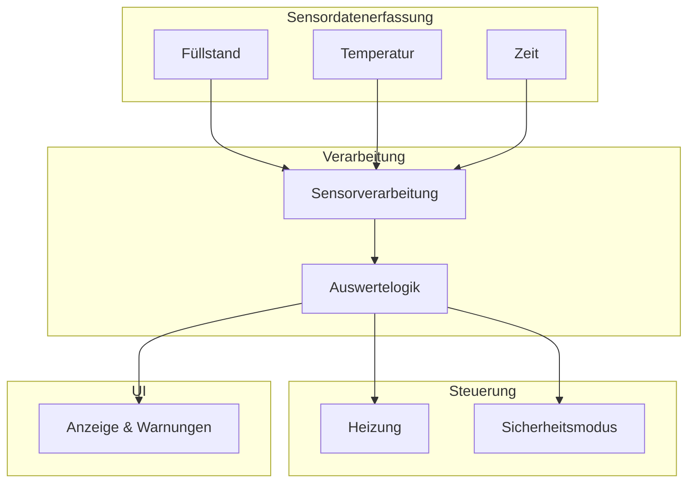

# Architektur 

# Softwarearchitektur – kompakte Schichtenübersicht



# Softwarearchitektur – Komponenten, Aufgaben & Requirements

| **Komponente**           | **Aufgaben**                                                                 | **Zugeordnete Requirements** |
|---------------------------|----------------------------------------------------------------------------|-----------------------------|
| **Füllstandssensor**      | Misst Füllstand, prüft Sensorfehler, liefert Werte an Verarbeitung          | R1.1                        |
| **Temperatursensor**      | Misst Heizplattentemperatur, erkennt Überhitzung                            | R1.2                        |
| **RTC/Timer**             | Liefert Zeitstempel für Soll/Ist-Vergleich und Sensorabfragen              | R1.3                        |
| **Sensorverarbeitung**    | Glättung der Messwerte, Temperaturkompensation, Berechnung tatsächlicher Füllstand | R3.3                        |
| **Auswertelogik**         | Vergleich Soll/Ist, Erkennung von Normal/Warnung/Kritisch, Weitergabe an Steuerung & UI | R2.1                        |
| **Heizung**               | Aktivierung/Deaktivierung der Heizung, Umsetzung der Sicherheitsregeln      | R3.1                        |
| **Sicherheitsmodus**      | Trockenlaufschutz, Abschaltung bei kritischen Sensorwerten                 | R3.1                        |
| **Anzeige & Warnungen**   | Darstellung von Füllstand & Temperatur, Anzeige von Warnungen und Fehlern    | R5.1, R5.2                  |


# Klassendiagramm

````mermaid
classDiagram
    class SystemController {
        - SensorManager sensors
        - StateDetector state
        - HeaterControl heater
        - UserInterface ui
        + setup()
        + loop()
        + executeCycle()
    }

    class SensorManager {
        - FillLevelSensor fillSensor
        - TemperatureSensor tempSensor
        + updateAll()
        + validate()
    }

    class FillLevelSensor {
        - int analogPin
        - float levelPercent
        + readValue()
        + getLevel()
    }

    class TemperatureSensor {
        - int dataPin
        - float temperature
        - float deltaT
        + readTemp()
        + calcRate()
    }

    class StateDetector {
        - String state
        - float level
        - float temp
        + determineState()
        + getState()
    }

    class HeaterControl {
        - int relayPin
        - bool active
        + switchOn()
        + switchOff()
        + update()
    }

    class UserInterface {
        - Display display
        - Buzzer buzzer
        + updateUI()
        + readInput()
    }

    class Display {
        - String message
        - int colorCode
        + showLevel()
        + showTemp()
        + showWarning()
    }

    class Buzzer {
        - int buzzerPin
        + beepShort()
        + beepLong()
        + warnTone()
    }

    SystemController --> SensorManager
    SystemController --> StateDetector
    SystemController --> HeaterControl
    SystemController --> UserInterface
    SensorManager --> FillLevelSensor
    SensorManager --> TemperatureSensor
    UserInterface --> Display
    UserInterface --> Buzzer
````
