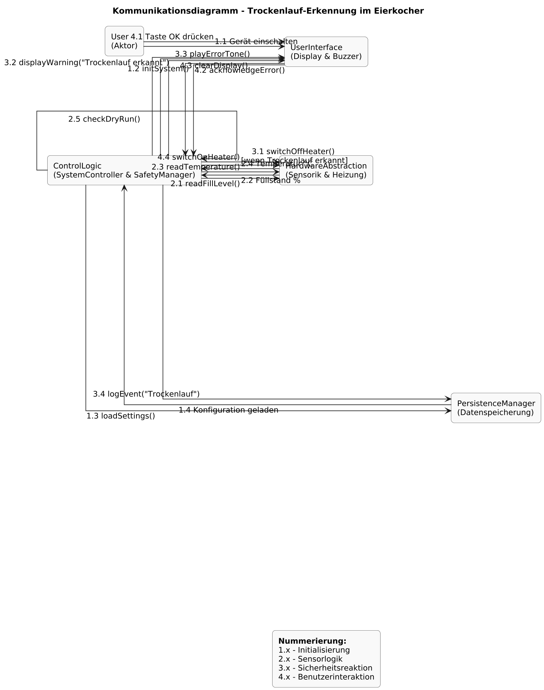

# Design
## Klassendiagramm

## 1. Zweck des Klassendiagramms
Das Klassendiagramm beschreibt die objektorientierte Struktur der Software für den **Trockenlaufschutz eines Eierkochers**.  
Es dient der logischen Modellierung aller wesentlichen Systemkomponenten und stellt deren **Verantwortlichkeiten, Attribute, Methoden und Beziehungen** dar.  
Die Architektur folgt dem **Schichtenmodell** aus:

- **UserInterface** (Anzeige, Ton, Eingabe)  
- **Steuerungslogik** (Systemsteuerung, Zustandsmanagement, Sicherheit)  
- **HardwareAbstraction** (Sensor- und Aktorsteuerung)  
- **PersistenceManager** (Datenspeicherung und Kalibrierung)

Dieses Diagramm bildet die Grundlage für die Implementierung auf einem **Arduino Nano** mit C++.

---

## 2. Überblick über die Struktur
Die Software besteht aus vier Hauptschichten mit den zugehörigen Klassen:

| **Schicht** | **Klassen** | **Beschreibung** |
|--------------|-------------|------------------|
| **UserInterface** | `DisplayController`, `BuzzerController`, `InputHandler` | Verwaltung von Anzeige, akustischer Signalisierung und Benutzereingaben |
| **Steuerungslogik** | `SystemController`, `StateDetector`, `SafetyManager`, `ThresholdManager` | Zentrale Steuerung, Zustandsüberwachung und Sicherheitslogik |
| **HardwareAbstraction** | `FillLevelSensor`, `TemperatureSensor`, `HeaterControl`, `TimerService` | Ansteuerung und Abstraktion der Sensoren und Aktoren |
| **PersistenceManager** | `CalibrationData`, `SettingsStorage` | Verwaltung von Kalibrierungsdaten und Persistenzspeicherung |

---

## 3. Klassendokumentation

### 3.1 `SystemController`
**Rolle:** Hauptsteuerung der Anwendung  
**Schicht:** Steuerungslogik  

**Aufgaben:**
- Führt den Hauptzyklus (`loop`) aus  
- Liest Sensordaten ein  
- Prüft Zustände und Sicherheitsbedingungen  
- Steuert Anzeige, Summer und Heizung  

**Attribute:**
- `fillSensor : FillLevelSensor`  
- `tempSensor : TemperatureSensor`  
- `heater : HeaterControl`  
- `ui : DisplayController`  
- `buzzer : BuzzerController`  

**Methoden:**
- `setup()` – Initialisierung von Komponenten  
- `executeCycle()` – Ablaufsteuerung  
- `handleError(errorCode : int)` – Fehlerbehandlung  
- `updateSystemState()` – Zustandslogik aktualisieren  

---

### 3.2 `StateDetector`
**Rolle:** Erkennung des aktuellen Systemzustands (Bereit, Warnung, Trockenlauf, Fehler)  
**Schicht:** Steuerungslogik  

**Aufgaben:**
- Auswertung von Füllstand und Temperatur  
- Rückgabe eines logischen Zustands zur Anzeige und Steuerung  

**Attribute:**
- `currentState : string`  
- `fillLevel : int`  
- `temperature : float`  

**Methoden:**
- `detectState(fillLevel : int, temperature : float) : string`  
- `getState() : string`

---

### 3.3 `SafetyManager`
**Rolle:** Überwachung und Schutzfunktionen  
**Schicht:** Steuerungslogik  

**Aufgaben:**
- Prüft Trockenlaufbedingungen  
- Löst Sicherheitsabschaltung aus  
- Verwaltet Fail-Safe-Verhalten  

**Attribute:**
- `dryRunDetected : bool`  

**Methoden:**
- `checkDryRun(fillLevel : int, tempRise : float) : bool`  
- `emergencyShutdown()` – Heizung abschalten  

---

### 3.4 `DisplayController`
**Rolle:** Anzeige der Systemzustände  
**Schicht:** UserInterface  

**Aufgaben:**
- Aktualisiert die Displayanzeige (Füllstand, Temperatur, Warnungen, Fehler)  
- Steuert farbliche und symbolische Darstellung  

**Attribute:**
- `fillLevelDisplay : int`  
- `temperatureDisplay : int`  
- `warningMessage : string`  

**Methoden:**
- `updateDisplay(fillLevel : int, temperature : int, status : string)`  
- `showWarning(message : string)`  
- `clearDisplay()`  

---

### 3.5 `BuzzerController`
**Rolle:** Akustische Signalisierung  
**Schicht:** UserInterface  

**Aufgaben:**
- Ausgabe von Warn- und Fehlertönen  
- Steuerung der Signalarten (kurz/lang)  

**Attribute:**
- `buzzerPin : int`  

**Methoden:**
- `playWarningTone()`  
- `playErrorTone()`  
- `stopTone()`  

---

### 3.6 `InputHandler`
**Rolle:** Benutzerinteraktion (Taster/Encoder)  
**Schicht:** UserInterface  

**Aufgaben:**
- Liest Eingaben ein  
- Übermittelt Benutzeraktionen an die Steuerlogik  

**Attribute:**
- `buttonPin : int`  
- `buttonState : bool`  

**Methoden:**
- `readInput() : bool`  
- `isButtonPressed() : bool`

---

### 3.7 `FillLevelSensor`
**Rolle:** Erfassung des Wasserstands  
**Schicht:** HardwareAbstraction  

**Aufgaben:**
- Liest analogen Sensorwert  
- Berechnet Prozentfüllstand  
- Prüft Messwert auf Plausibilität  

**Attribute:**
- `analogPin : int`  
- `fillLevelPercent : int`  

**Methoden:**
- `readLevel() : int`  
- `isValid() : bool`

---

### 3.8 `TemperatureSensor`
**Rolle:** Messung der Temperatur  
**Schicht:** HardwareAbstraction  

**Aufgaben:**
- Liest Temperaturwert (NTC oder DS18B20)  
- Berechnet Temperaturänderungsrate  

**Attribute:**
- `tempPin : int`  
- `temperature : float`  

**Methoden:**
- `readTemperature() : float`  
- `getDeltaT() : float`

---

### 3.9 `HeaterControl`
**Rolle:** Steuerung der Heizleistung  
**Schicht:** HardwareAbstraction  

**Aufgaben:**
- Schaltet Heizelement über Relais oder MOSFET  
- Prüft Zustand der Heizung  

**Attribute:**
- `relayPin : int`  
- `isOn : bool`  

**Methoden:**
- `switchOn()`  
- `switchOff()`  
- `getStatus() : bool`

---

### 3.10 `SettingsStorage`
**Rolle:** Verwaltung persistenter Parameter  
**Schicht:** PersistenceManager  

**Aufgaben:**
- Laden und Speichern von Grenzwerten und Kalibrierungsdaten  
- Zugriff auf Fehlerhistorie  

**Attribute:**
- `warningThreshold : int`  
- `criticalThreshold : int`  

**Methoden:**
- `loadSettings()`  
- `saveSettings()`  
- `getCalibrationData() : CalibrationData`

---

### 3.11 `CalibrationData`
**Rolle:** Speicherung der Kalibrierungsdaten  
**Schicht:** PersistenceManager  

**Aufgaben:**
- Verwaltung der Füllstands- und Temperaturkennlinien  
- Bereitstellung von Korrekturwerten für Sensorik  

**Attribute:**
- `fillCalibValues : int[]`  
- `tempCalibValues : float[]`  

**Methoden:**
- `getFillCalib() : int[]`  
- `getTempCalib() : float[]`

---

## 4. Beziehungen zwischen den Klassen

| **Beziehung** | **Beteiligte Klassen** | **Beschreibung** |
|----------------|------------------------|------------------|
| Aggregation | `SystemController` → `FillLevelSensor`, `TemperatureSensor`, `HeaterControl`, `DisplayController` | Zentrale Steuerung besitzt und verwendet diese Komponenten |
| Assoziation | `SystemController` ↔ `SafetyManager`, `StateDetector` | Logische Zusammenarbeit bei Zustandsprüfung |
| Komposition | `UserInterface` ↔ `DisplayController`, `BuzzerController`, `InputHandler` | UI besteht aus diesen Subkomponenten |
| Abhängigkeit | `Steuerungslogik` → `PersistenceManager` | Steuerlogik nutzt gespeicherte Parameter |
| Aggregation | `SettingsStorage` → `CalibrationData` | Persistenzmodul enthält Kalibrierdatenobjekt |

---

## 5. Zusammenhang mit Anforderungen

| **Requirement-ID** | **Betroffene Klassen** | **Beschreibung** |
|---------------------|------------------------|------------------|
| R1.1, R1.2 | `FillLevelSensor`, `TemperatureSensor` | Erfassen und Filtern von Messwerten |
| R2.1–R3.3 | `SystemController`, `StateDetector`, `SafetyManager` | Zustandslogik und Sicherheitsüberwachung |
| R4.1–R4.3 | `SettingsStorage`, `CalibrationData` | Selbsttest, Fehlerdiagnose, Datenspeicherung |
| R5.1–R5.5 | `DisplayController`, `BuzzerController`, `InputHandler` | Anzeige, Warnungen und Benutzerinteraktion |

---

Das Klassendiagramm gewährleistet eine **klare Trennung der Verantwortlichkeiten** und eine **testbare modulare Struktur**.  
Durch die Schichtenarchitektur ist das System:
- **erweiterbar** (z. B. Bluetooth-Diagnose, Logging),
- **fehlertolerant** (Sicherheitsabschaltung über SafetyManager),
- **wartbar** (klare Schnittstellen),
- und **hardwareunabhängig** (dank Abstraktionsschicht).

Damit erfüllt die Architektur die funktionalen und nicht-funktionalen Anforderungen aus dem Pflichtenheft vollständig.

## Sequenzdiagramm

## 1. Zweck des Sequenzdiagramms

Das Sequenzdiagramm stellt den **Ablauf der Kommunikation zwischen den Systemkomponenten** während eines Trockenlauf-Ereignisses dar.  
Es visualisiert den **zeitlichen Ablauf** der Interaktionen zwischen **Benutzer, Steuerlogik, Sensorik, Anzeige- und Sicherheitssystemen**, um zu zeigen, wie das System auf einen kritischen Zustand reagiert.

Das Diagramm dient der **Überprüfung der Funktionslogik** und stellt sicher,  
dass alle Anforderungen aus dem Pflichtenheft, insbesondere die unter **R3.1–R3.3 (Trockenlaufschutz und Sicherheitsabschaltung)**, korrekt umgesetzt sind.

---

## 2. Beteiligte Objekte / Akteure

| **Objekt / Akteur** | **Beschreibung** |
|----------------------|------------------|
| **Benutzer** | Startet das Gerät und quittiert Fehlermeldungen. |
| **DisplayController (UI)** | Zeigt aktuelle Zustände, Warnungen und Fehlermeldungen an. |
| **SystemController (Control Logic)** | Zentrale Steuerung; koordiniert alle Komponenten und Abläufe. |
| **SafetyManager (Control Logic)** | Überprüft Sensorwerte auf Trockenlaufbedingungen und führt Sicherheitsabschaltungen aus. |
| **FillLevelSensor (Hardware)** | Erfasst den aktuellen Wasserstand. |
| **TemperatureSensor (Hardware)** | Misst die Temperatur der Heizplatte. |
| **HeaterControl (Hardware)** | Steuert das Heizelement (An/Aus). |
| **BuzzerController (UI)** | Gibt akustische Warnungen oder Fehlertöne aus. |
| **SettingsStorage (Persistence)** | Speichert Fehlerereignisse und Systemparameter. |

---

## 3. Ablaufbeschreibung

### 3.1 Initialisierung
1. Der **Benutzer** schaltet das Gerät ein.  
2. Der **DisplayController** zeigt den Startbildschirm.  
3. Der **SystemController** lädt über den **SettingsStorage** die gespeicherten Schwellenwerte und Kalibrierungsdaten.  
4. Alle Sensoren werden initialisiert, und das System geht in den Zustand **"Bereit"** über.

---

### 3.2 Zyklische Sensordatenerfassung
1. Der **SystemController** ruft regelmäßig (alle 200 ms) die Werte des **FillLevelSensor** und **TemperatureSensor** ab.  
2. Diese Messwerte werden gefiltert und an den **SafetyManager** übergeben.  
3. Der **SafetyManager** berechnet die Änderungsrate der Temperatur (ΔT/Δt) und überprüft den Füllstand.  

---

### 3.3 Trockenlauf-Erkennung
1. Wird erkannt, dass der **Füllstand < 10 %** ist **oder** die Temperatur **mehr als 5 °C/s** steigt, meldet der **SafetyManager** einen Trockenlauf an den **SystemController**.  
2. Der **SystemController** löst sofort folgende Aktionen aus:
   - Abschalten der Heizung über den **HeaterControl** (`switchOff()`).
   - Anzeige der Fehlermeldung „Trockenlauf erkannt“ über den **DisplayController**.
   - Akustisches Signal (3× langer Ton) über den **BuzzerController**.
   - Loggen des Ereignisses im **SettingsStorage**.

---

### 3.4 Benutzerquittierung
1. Der **Benutzer** betätigt die Taste „OK“, um die Fehlermeldung zu quittieren.  
2. Der **InputHandler** meldet die Eingabe an den **SystemController**.  
3. Der **SystemController** löscht die Anzeige, schaltet das Heizelement wieder frei und wechselt in den Zustand **"Bereit"**.  

---

## 4. Zeitliche Abfolge (Kurzbeschreibung)

| **Schritt** | **Aktion** | **Beteiligte Komponenten** |
|--------------|-------------|-----------------------------|
| 1 | Systemstart | Benutzer, DisplayController, SystemController |
| 2 | Laden von Kalibrierungsdaten | SystemController, SettingsStorage |
| 3 | Sensordaten erfassen | FillLevelSensor, TemperatureSensor |
| 4 | Trockenlauf erkennen | SafetyManager |
| 5 | Sicherheitsabschaltung | HeaterControl |
| 6 | Fehleranzeige & Warnsignal | DisplayController, BuzzerController |
| 7 | Ereignis speichern | SettingsStorage |
| 8 | Fehlerquittierung durch Benutzer | InputHandler, SystemController |

---

## 5. Fehlerbehandlung und Sicherheitslogik

- Die **Abschaltung** erfolgt **innerhalb von ≤ 1 s** nach Erkennung der Trockenlaufbedingung.  
- Bei Sensorausfall oder unplausiblen Werten wird der gleiche Sicherheitsmechanismus ausgelöst.  
- Der **SafetyManager** arbeitet nach dem **Fail-Safe-Prinzip**:  
  Jede Unsicherheit führt zu einem sicheren Zustand (Heizung aus, Warnung aktiv).  
- Nach erfolgreicher Quittierung wird der **Normalbetrieb** automatisch wieder aufgenommen.

---

## 6. Bezug zu Requirements

| **Requirement-ID** | **Beschreibung** | **Abgebildet durch** |
|--------------------|------------------|----------------------|
| **R3.1** | Trockenlaufabschaltung bei Füllstand < 10 % oder Temperaturanstieg > 5 °C/s | SafetyManager, SystemController |
| **R3.2** | Warnanzeige & akustisches Signal bei Trockenlauf | DisplayController, BuzzerController |
| **R3.3** | Speicherung des Fehlers und Reaktivierung nach Quittierung | SettingsStorage, InputHandler |
| **R4.2** | Fehlerklassifizierung und Sicherheitsreaktion | SafetyManager |
| **R5.1–R5.4** | Benutzerinteraktion & Anzeige | UserInterface-Komponenten |

---

Das Sequenzdiagramm verdeutlicht, wie der **Trockenlaufschutz** technisch abläuft und welche Komponenten beteiligt sind.  
Durch den klar strukturierten Ablauf wird sichergestellt, dass:

- Sicherheitsfunktionen **deterministisch und zeitnah** ausgeführt werden,  
- alle Systemzustände für den Benutzer **verständlich visualisiert** sind,  
- das System **robust und fehlertolerant** auf Sensorfehler reagiert,  
- und das Verhalten den **funktionalen Anforderungen (R1–R5)** aus dem Pflichtenheft vollständig entspricht.

Damit dient das Sequenzdiagramm als **Beleg der dynamischen Systemarchitektur** und zeigt die **Interaktion zwischen Softwaremodulen und Hardware** während des sicherheitskritischen Betriebsfalls.

## Kommunikationsdiagramm

## 1. Ziel des Diagramms
Das Kommunikationsdiagramm zeigt die **Interaktion und Nachrichtenflüsse** zwischen den Hauptkomponenten des Systems  
während eines **Trockenlauf-Ereignisses**.  
Im Gegensatz zum Sequenzdiagramm steht hier nicht die zeitliche Reihenfolge,  
sondern die **kommunikative Verknüpfung** der Module im Vordergrund.  
Es verdeutlicht, wie die Schichten **UserInterface**, **ControlLogic**, **HardwareAbstraction** und **PersistenceManager**  
gemeinsam den sicherheitskritischen Fall „Trockenlauf erkannt“ verarbeiten.

---

## 2. Beteiligte Komponenten

| **Komponente** | **Rolle / Funktion** |
|----------------|----------------------|
| **User (Aktor)** | Startet und quittiert den Prozess (z. B. Einschalten, OK-Taste). |
| **UserInterface (Display & Buzzer)** | Visualisiert Warnungen, zeigt Fehler an und gibt akustische Signale aus. |
| **ControlLogic (SystemController & SafetyManager)** | Zentrale Steuerung, Zustandsüberwachung und Sicherheitsabschaltung. |
| **HardwareAbstraction (Sensorik & Heizung)** | Liest Sensordaten aus (Füllstand, Temperatur) und schaltet die Heizung. |
| **PersistenceManager (Datenspeicherung)** | Speichert Schwellenwerte, Kalibrierungen und Fehlerhistorie. |

---

## 3. Ablaufbeschreibung

1. **Initialisierung:**  
   Der Benutzer schaltet das Gerät ein.  
   → `UserInterface` informiert die `ControlLogic`, welche über den `PersistenceManager` gespeicherte Einstellungen lädt.  

2. **Sensordatenerfassung:**  
   `ControlLogic` fragt über `HardwareAbstraction` die Sensoren ab (Füllstand, Temperatur).  

3. **Trockenlauf-Erkennung:**  
   Der `SafetyManager` innerhalb der `ControlLogic` erkennt den Trockenlauf (Füllstand < 10 % oder Temperaturanstieg > 5 °C/s).  
   → Heizung wird deaktiviert, Warnungen und Töne werden aktiviert, Ereignis wird gespeichert.  

4. **Benutzerinteraktion:**  
   Der Benutzer bestätigt den Fehler über die Taste **OK**.  
   → Anzeige wird gelöscht, System kehrt in den Zustand „Bereit“ zurück, Heizung wird wieder freigegeben.

---

## 4. Kommunikationsstruktur (Kurzüberblick)

| **Absender** | **Empfänger** | **Nachricht / Aktion** |
|---------------|----------------|-------------------------|
| `User` | `UserInterface` | Gerät einschalten / Taste OK drücken |
| `UserInterface` | `ControlLogic` | `initSystem()`, `acknowledgeError()` |
| `ControlLogic` | `PersistenceManager` | `loadSettings()`, `logEvent()` |
| `ControlLogic` | `HardwareAbstraction` | `readFillLevel()`, `readTemperature()`, `switchOffHeater()` |
| `ControlLogic` | `UserInterface` | `displayWarning()`, `playErrorTone()`, `clearDisplay()` |

---

## 5. Bezug zu Requirements

| **Requirement-ID** | **Abgebildet durch Kommunikation zwischen** | **Beschreibung** |
|--------------------|----------------------------------------------|------------------|
| **R1.1–R1.2** | ControlLogic ↔ HardwareAbstraction | Erfassen von Füllstand und Temperatur |
| **R2.1–R3.3** | ControlLogic ↔ SafetyManager ↔ UI | Zustandslogik und Trockenlaufabschaltung |
| **R4.1–R4.3** | ControlLogic ↔ PersistenceManager | Selbsttest, Kalibrierung, Fehlerlogging |
| **R5.1–R5.5** | User ↔ UI ↔ ControlLogic | Anzeige, Warnsignale, Benutzerquittierung |

---

Das Kommunikationsdiagramm zeigt die **strukturierte Zusammenarbeit** aller Systemkomponenten:  
- **ControlLogic** ist der zentrale Koordinator,  
- **HardwareAbstraction** liefert Messwerte,  
- **UserInterface** meldet Zustände an den Benutzer,  
- **PersistenceManager** sichert Daten dauerhaft.  

Diese Architektur gewährleistet **klare Schnittstellen, hohe Testbarkeit** und erfüllt alle sicherheitsrelevanten Anforderungen  
zum **Trockenlaufschutz (R3.1–R3.3)** aus dem Pflichtenheft.

## Design Pattern

## 1. Model-View-Controller (MVC)

**Art:** Architektur-Pattern  
**Verwendung:** Zentrales Entwurfsmuster des Systems

### Beschreibung
Das gesamte System folgt dem **MVC-Prinzip**, um **Darstellung, Logik und Hardwarezugriff klar zu trennen**.

| Schicht | Komponenten / Klassen | Aufgabe |
|----------|-----------------------|----------|
| **Model** | `SystemController`, `SafetyManager`, `StateDetector`, `FillLevelSensor`, `TemperatureSensor`, `HeaterControl` | Verwaltung von Zuständen, Logik und Sensordaten |
| **View** | `DisplayController`, `BuzzerController` | Darstellung von Systemzuständen, Warnungen und Fehlern |
| **Controller** | `InputHandler`, `SystemController` | Vermittlung zwischen Benutzerinteraktion, Anzeige und Logik |

### Vorteile
- Klare Trennung der Verantwortlichkeiten  
- Einfach test- und wartbar  
- Erweiterbar (z. B. neue Anzeige oder neue Sensoren)

---

## 2. Singleton

**Art:** Erzeugungs-Pattern  
**Verwendung:** In der Klasse `SystemController`

### Beschreibung
Der `SystemController` ist als **Singleton** konzipiert, da nur **eine Instanz** im gesamten System existieren darf.  
Er steuert den Ablauf, verwaltet Sensor- und Logikkomponenten und koordiniert alle Subsysteme.

### Vorteile
- Zentrale Steuerinstanz  
- Einheitlicher Zugriff auf Systemstatus  
- Vermeidung von Mehrfachinstanzen und widersprüchlichen Zuständen

---

## 3. Command

**Art:** Verhaltens-Pattern  
**Verwendung:** Konzeptuell in `InputHandler` vorbereitet

### Beschreibung
Das Command-Pattern ist vorbereitet, um Benutzeraktionen als **Befehle** zu kapseln.  
So könnte z. B. ein Tastendruck (`OK`) als eigenes Kommando-Objekt (`AcknowledgeErrorCommand`) umgesetzt werden.  
Dieses kann unabhängig von der Steuerlogik ausgeführt oder erweitert werden.

### Vorteile
- Entkopplung von Eingabe und Logik  
- Leichte Erweiterbarkeit (neue Befehle, z. B. Reset, Diagnose)  
- Saubere Trennung von Event-Verarbeitung und Systemreaktion

---

## Zusammenfassung

| **Design Pattern** | **Art** | **Verwendet in** | **Zweck / Nutzen** |
|--------------------|----------|------------------|--------------------|
| **Model-View-Controller (MVC)** | Architekturpattern | Gesamtsystem | Strukturierte Trennung von Logik, UI und Hardware |
| **Singleton** | Erzeugungsmuster | `SystemController` | Zentrale Steuerinstanz, nur eine Systemlogik-Instanz |
| **Command** | Verhaltensmuster (optional) | `InputHandler` | Entkopplung von Benutzerinteraktion und Steuerlogik |

---
