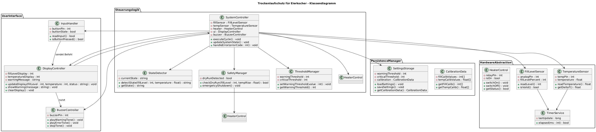

# Design




# Softwarearchitektur – Design-Komponenten

```mermaid
graph TD
    %% Schicht 1: Sensordatenerfassung
    subgraph Sensordatenerfassung
        FILL[Füllstandsmessung]
        TEMP[Temperaturmessung]
        TIME[Zeitgeber]
    end

    %% Schicht 2: Datenverarbeitung & Zustandsüberwachung
    subgraph Auswerte-Steuerlogik
        DAT[Sensor-Datenverarbeitung]
        SIV[Soll/Ist-Vergleich]
        STATUS[Statusverwaltung]
    end

    %% Schicht 3: Steuerlogik & Sicherheit
    subgraph Steuerung
        HEAT[Heizungssteuerung]
        SAFETY[Trockenlaufschutz/Sicherheitsmodus]
    end

    %% Schicht 4: Benutzerinterface
    subgraph UI
        DISPLAY_FILL[Füllstandsanzeige]
        DISPLAY_TEMP[Temperaturanzeige]
        WARN[Warn- & Fehlermeldung]
    end

    %% Schicht 5: Test & Diagnose
    subgraph Test_und_Diagnose
        SELFTEST[Selbsttest & Plausibilitätsprüfung]
        ERROR[Fehleranalyse]
    end

    %% Datenflüsse zwischen den Komponenten
    FILL --> DAT
    TEMP --> DAT
    TIME --> DAT
    DAT --> SIV
    SIV --> STATUS
    STATUS --> HEAT
    STATUS --> SAFETY
    STATUS --> DISPLAY_FILL
    STATUS --> DISPLAY_TEMP
    STATUS --> WARN
    SELFTEST --> DAT
    SELFTEST --> SIV
    SELFTEST --> WARN
    ERROR --> STATUS
    ERROR --> WARN
````

# Software-Design-Komponenten

Die folgende Tabelle zeigt die Zerlegung der Architektur-Ebenen (Sensorik, Auswertelogik, Steuerlogik, Benutzerinterface)  
in kleinere Software-Design-Komponenten.  
Diese Beschreibung erfolgt **ohne objektorientierte Modellierung** (also nur Funktionsblöcke).

| **Architektur-Ebene** | **Software-Design-Komponente** | **Aufgabe / Beschreibung** | **Eingabe** | **Ausgabe** |
|------------------------|--------------------------------|-----------------------------|--------------|--------------|
| **Sensorik** | `FillLevelReader` | Erfasst den analogen Füllstandswert, normiert auf 0–100 %, filtert Messrauschen. | Analoge Spannung (0–3,3 V) | Prozentwert (0–100 %), gefiltert |
|  | `TemperatureReader` | Liest Temperatur über NTC oder DS18B20, berechnet Temperaturdifferenz ΔT/Δt. | Digitalwert / Widerstand | Temperaturwert in °C, Änderungsrate |
|  | `SensorValidator` | Prüft Sensordaten auf Plausibilität (0–100 %, 0–150 °C). | Messwerte | Status: OK / Fehlercode |
| **Auswertelogik** | `DataFilter` | Gleitender Mittelwert über letzte n Messpunkte, um Schwankungen zu glätten. | Rohdaten | Gefilterte Werte |
|  | `StateDetector` | Erkennt Systemzustand (Bereit, Warnung, Trockenlauf, Überhitzung). | Sensordaten | Zustandskennung |
|  | `ThresholdManager` | Verarbeitet benutzerdefinierte Warnschwelle (10–50 %). | Eingabewert | Grenzwert |
|  | `DryRunDetector` | Ermittelt Trockenlauf anhand Füllstand < 10 % oder ΔT > 5 °C/s. | Sensordaten | Trockenlauf-Flag |
| **Steuerlogik** | `HeaterControl` | Steuert Relais/MOSFET zur Heizungsabschaltung bei kritischem Zustand. | Zustand, Sensorwerte | Schaltsignal (Ein/Aus) |
|  | `SafetyManager` | Koordiniert Sicherheitsabschaltung bei Trockenlauf, Überhitzung, Sensorfehler. | Fehlerstatus | Relais Aus, Warnsignal |
|  | `SystemController` | Hauptzyklus: liest Sensoren, aktualisiert Zustände, steuert UI und Heizung. | Alle Daten | Steuerbefehle |
|  | `SelfTestManager` | Führt Start-Selbsttest und zyklische Prüfungen durch. | Sensorstatus | Testresultat / Fehlercode |
| **Benutzerinterface (UI)** | `DisplayController` | Zeigt Werte, Warnungen und Fehler an (Farbcode, Text, Symbole). | Zustand, Messdaten | LCD-Ausgabe |
|  | `BuzzerController` | Erzeugt akustische Warnsignale (2× kurz, 3× lang). | Fehlerzustand | Tonmuster |
|  | `InputHandler` | Liest Taste / Encoder, verarbeitet Quittierungen und Einstellungen. | Benutzereingabe | Befehle an Steuerlogik |
| **Systemdienste** | `TimerService` | Zeitbasis für Messintervalle, Selbsttest, Blinken etc. | Systemzeit | Zeitstempel, Timer-Ereignisse |
|  | `Logger` *(optional)* | Speichert Fehlerhistorie und Betriebsdaten (z. B. Trockenlaufzähler). | Ereignisse | Logdaten |
|  | `CommInterface` *(optional)* | Schnittstelle für serielle Diagnose oder Bluetooth. | Datenpakete | Debug-/Diagnosedaten |

