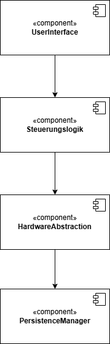

# Architektur – Trockenlaufschutz für Eierkocher

## Architekturmuster festlegen

**Schichtenarchitektur**

- Klare Trennung der Verantwortlichkeiten:
  - Hardwarenahe Funktionen (Sensorik, Relais-Steuerung)
  - Anwendungslogik (Trockenlaufschutz, Zustandsüberwachung)
  - Benutzeroberfläche (Display, Summer)
  - Datenspeicherung (Kalibrierung, Schwellenwerte)
- Jede Schicht ist unabhängig test- und austauschbar.
- Funktionale Gruppierung → Kapselung und Entkopplung.
- Jede Schicht darf nur **die direkt darunterliegende Schicht** ansprechen.
  - Keine Rückwärtssprünge oder Querkommunikation.

## Komponentenübersicht

| **Komponente**          | **Requirements**                                                              | **Traceability**  |
| ----------------------- | ----------------------------------------------------------------------------- | ---------------------------- |
| **UserInterface**       | R5.1 – R5.5 (Anzeige, akustische Signale, Eingabe, Barrierefreiheit)          | R5.1, R5.2, R5.3, R5.4, R5.5 |
| **Steuerungslogik**     | R2.1 – R3.3 (Zustandslogik, Sicherheitsabschaltung, Trockenlauf-Erkennung)    | R2.1, R2.2, R3.1, R3.2, R3.3 |
| **HardwareAbstraction** | R1.1 – R1.3 (Sensoransteuerung, Heizungsschaltung, Zeitgeber)                 | R1.1, R1.2, R1.3             |
| **PersistenceManager**  | R4.1 – R4.3 (Selbsttest, Kalibrierung, Fehlerhistorie, Plausibilitätsprüfung) | R4.1, R4.2, R4.3             |

## Beschreibung Komponenten

| **Komponente**          | **Rolle**                  | **Verantwortlichkeiten**                                                                                                                                               |
| ----------------------- | -------------------------- | ---------------------------------------------------------------------------------------------------------------------------------------------------------------------- |
| **UserInterface**       | Präsentationsschicht       | Anzeige von Füllstand, Temperatur und Warnungen; Ausgabe akustischer Signale; Verarbeitung von Benutzereingaben (Taster, Encoder); Rückmeldung an Steuerungslogik      |
| **Steuerungslogik**     | Anwendungslogik            | Überwachung des Systemzustands (Bereit, Warnung, Trockenlauf, Überhitzung); Steuerung der Heizung; Auswertung von Sensordaten; Auslösen von Warn- und Abschaltsignalen |
| **HardwareAbstraction** | Hardware-Interface         | Zugriff auf Füllstands- und Temperatursensoren; Steuerung des Relais; Bereitstellung der Zeitbasis; Vereinheitlichung der hardwarenahen Funktionen                     |
| **PersistenceManager**  | Speicher-/Diagnose-Schicht | Verwaltung und Speicherung von Kalibrierungsdaten, Fehlerhistorie und Warnschwellen; Bereitstellung persistenter Parameter für Tests und Sicherheitslogik              |

## Schnittstellendefinition

| **Ziel**              | **Quelle**            | **Schnittstellen / Methoden (Beispiele)**                         |
| --------------------- | --------------------- | ----------------------------------------------------------------- |
| `UserInterface`       | `Steuerungslogik`     | `updateDisplay(state)`, `showWarning(message)`, `playTone(type)`  |
| `UserInterface`       | `HardwareAbstraction` | `readButtonInput()`                                               |
| `Steuerungslogik`     | `HardwareAbstraction` | `getFillLevel()`, `getTemperature()`, `setHeater(onOff)`          |
| `Steuerungslogik`     | `PersistenceManager`  | `loadThresholds()`, `saveErrorLog(code)`, `readCalibrationData()` |
| `HardwareAbstraction` | `PersistenceManager`  | `loadSensorOffsets()`, `saveRuntimeStats()`                       |

## Technologiestack

| **Kategorie**           | **Technologie / Tool**           | **Begründung**                                                    |
| ----------------------- | -------------------------------- | ----------------------------------------------------------------- |
| **Programmiersprache**  | C / C++ (Arduino-Umgebung)       | Direkter Zugriff auf Sensoren und Aktoren, gute Echtzeitfähigkeit |
| **Buildsystem**         | Arduino IDE / PlatformIO         | Integrierte Toolchain für Mikrocontroller, einfache Handhabung    |
| **Versionskontrolle**   | GitHub                           | Standardlösung für kollaborative Softwareentwicklung              |
| **Dokumentation**       | Markdown + Mermaid / drawio      | Einheitliche Dokumentation im Repository, visuelle Diagramme      |
| **Test-Framework**      | Unity / GoogleTest (optional)    | Unterstützung von Unit- und Integrationstests                     |
| **IDE**                 | VS Code / Arduino IDE            | Schlanke Entwicklungsumgebung, Erfahrungen                        |
| **Ausgabe**             | OLED-Display + Summer            | Visuelle und akustische Benutzerinformation                       |

# Systemkomponenten 

- Sensorik (Füllstand, Temperatur, Timer)
- Mikrocontroller (Auswertelogik + Steuerlogik)
- Benutzer Interface (Display, Summer)
- Stromversorgung
- Heizelement

### 2.1 Interne Systemschnittstellen

| Schnittstelle | Quelle | Ziel | Art der Daten | Beschreibung | Kommunikationsart |
|---------------|--------|------|---------------|---------------|-------------------|
| Füllstandssensor → Auswertelogik | Sensor | Auswertelogik | Analog/Digitalwert (0–100 %) | Überträgt aktuellen Füllstand in Echtzeit (≤200 ms) | Asynchron (Sensor liefert Messwerte per Interrupt) |
| Temperatursensor → Auswertelogik | Sensor | Auswertelogik | Temperaturwert in °C | Meldet Heizplattentemperatur mit 5 Hz Abtastrate | Asynchron (periodisch getriggert durch Abtasttimer) |
| Zeitgeber → Steuerlogik | RTC/Timer | Steuerlogik | Zeitstempel | Liefert Zeit für Soll/Ist-Vergleiche, Plausibilitätstests | Synchron (Abfrage durch Steuerlogik bei Bedarf) |
| Auswertelogik → Steuerlogik | Auswertelogik | Steuerlogik | Sensorwerte | Meldet geglättete Sensorwerte zur Auswertung an Steuerlogik | Interprozesskommunikation (z. B. Message Queue oder Shared Memory zwischen Tasks) |
| Steuerlogik → Heizung | Steuerlogik | Heizsystem | Schaltbefehl (Ein/Aus) | Aktiviert/Deaktiviert Heizung je nach Sensorwerten | Synchron (direktes Steuersignal, digitaler Ausgang) |
| Steuerlogik → Display | Steuerlogik | Display | Status, Füllstand, Warnungen | Anzeige von Betriebszustand, Warnungen, Fehlern | Asynchron (Display-Update-Task per Event oder Timer) |
| Steuerlogik → Summer | Steuerlogik | Akustische Signalgeber | Signaltyp (2× kurz / 3× lang) | Warnt Benutzer bei kritischen Zuständen | Asynchron (Ereignisgesteuert durch Fehlerstatus) |
| Display → Steuerlogik | Display | Steuerlogik | Taster Input | Meldet Steuerlogik Quittierung des Trockenlaufes | Asynchron (Interrupt oder Event bei Benutzereingabe) |

---

### 2.2 Externe Schnittstellen

| Schnittstelle | Quelle | Ziel | Art der Daten | Beschreibung | Kommunikationsart |
|---------------|--------|------|---------------|---------------|-------------------|
| Benutzer → UI | Benutzer | System | Eingaben, Quittierung, Warnschwellen | Benutzer kann Warnwerte einstellen und Fehler quittieren | Asynchron (Ereignisgesteuerte Benutzereingabe) |
| Stromversorgung | Extern | System | Elektrische Energie | Versorgt Sensoren, Steuerung, Display und Heizung | Synchron (physikalisch kontinuierlich) |

