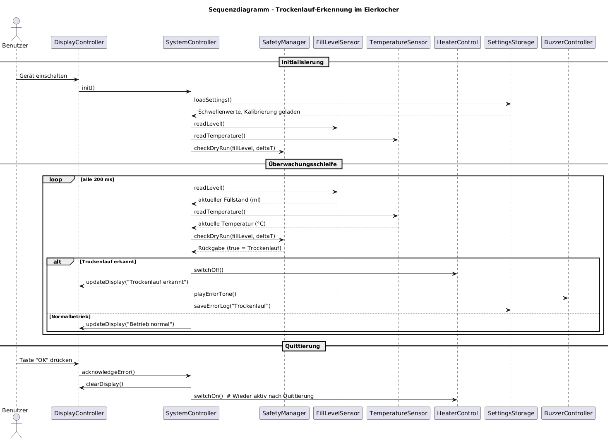

# Design 2

## Klassendiagramm

## 1. Zweck des Klassendiagramms

Das Klassendiagramm beschreibt die objektorientierte Struktur der Software für den **Trockenlaufschutz eines Eierkochers**.  
Es dient der logischen Modellierung aller wesentlichen Systemkomponenten und stellt deren **Verantwortlichkeiten, Attribute, Methoden und Beziehungen** dar.  

Die Architektur folgt weiterhin dem **Schichtenmodell**:

- **UserInterface** (Anzeige, Ton, Eingabe)  
- **Steuerungslogik (ControlLogic)** (Systemsteuerung, Zustandsmanagement, Sicherheit)  
- **HardwareAbstraction** (Sensor- und Aktorsteuerung)  
- **PersistenceManager** (Datenspeicherung und Kalibrierung)

Mit **Sprint 2** wird die bereits funktionierende Grundlogik aus Sprint 1 um sicherheitsrelevante Funktionen erweitert. Im Fokus stehen dabei insbesondere die Anforderungen:

- **R2.2** Kontinuierlicher Soll/Ist-Vergleich, Sicherheitsmodus  
- **R2.3** Fehleranalyse: Sensorfehler, Überhitzung  
- **R4.1** Plausibilitätsprüfung beim Einschalten  
- **R4.2** Fehlerklassifizierung  
- **R4.3** Zyklischer Selbsttest

Diese Anforderungen werden vor allem in der **Steuerungslogik** (SystemController, SafetyManager, StateDetector, ThresholdManager) umgesetzt.

Die Implementierung erfolgt weiterhin in **C++** in einer Arduino-ähnlichen Umgebung.

---

## 2. Überblick über die Struktur

Die Software besteht aus vier Hauptschichten mit den zugehörigen Klassen:

| **Schicht**           | **Klassen**                                                                 | **Beschreibung**                                                                                             |
|-----------------------|-----------------------------------------------------------------------------|--------------------------------------------------------------------------------------------------------------|
| **UserInterface**     | `DisplayController`, `BuzzerController`, `InputHandler`                    | Verwaltung von Anzeige, akustischer Signalisierung und Benutzereingaben                                     |
| **Steuerungslogik**   | `SystemController`, `StateDetector`, `SafetyManager`, `ThresholdManager`   | Zentrale Steuerung, Zustandsüberwachung, Sicherheitslogik, Schwellwertverwaltung                            |
| **HardwareAbstraction** | `FillLevelSensor`, `TemperatureSensor`, `HeaterControl`, `TimerService`  | Ansteuerung und Abstraktion der Sensoren und Aktoren, zeitgesteuerte Simulation                             |
| **PersistenceManager**| `CalibrationData`, `SettingsStorage`                                      | Verwaltung von Kalibrierungsdaten und persistenten Schwellwerten (Warn-/Kritisch-Schwellen)                 |

In Sprint 2 werden vor allem **SystemController**, **SafetyManager**, **StateDetector**, **ThresholdManager** sowie die enge Kopplung zu **SettingsStorage**, **FillLevelSensor** und **TemperatureSensor** erweitert, um die sicherheitskritischen Anforderungen umzusetzen.

---

## 3. Klassendokumentation

### 3.1 `SystemController`

**Rolle:** Hauptsteuerung der Anwendung, Sicherheits- und Überwachungslogik  
**Schicht:** Steuerungslogik  

**Aufgaben:**

- Führt den zentralen Steuerungszyklus `executeCycle()` aus  
- Liest Sensordaten (Füllstand, Temperatur) ein  
- Führt den **kontinuierlichen Soll/Ist-Vergleich** gegen Warn- und Kritisch-Schwellen durch (**R2.2**)  
- Nutzt `StateDetector`, um den logischen Systemzustand zu bestimmen  
- Stellt sicherheitskritische Funktionen bereit:
  - **Plausibilitätsprüfung beim Einschalten** via `performStartupPlausibilityCheck(...)` (**R4.1**)  
  - Überwachung auf **Sensorfehler** und Wechsel in einen **Sicherheitsmodus** via `enterSafetyMode(...)` (**R2.2, R4.2**)  
  - **Überhitzungserkennung** (Temperatur > Schwellwert) in Kombination mit `SafetyManager` (**R2.3**)  
  - **Zyklischer Selbsttest** auf stagnierende Messwerte via `runSelfTest(...)` (**R4.3**)  
- Steuert Anzeige (`DisplayController`), Buzzer (`BuzzerController`) und Heizung (`HeaterControl`)  
- Verarbeitet Benutzereingaben über `InputHandler` (z. B. zum Stummschalten von Warnsignalen)

**Wichtige Attribute (Auszug):**

- Referenzen auf Hardware- und UI-Klassen:
  - `fillSensor : FillLevelSensor&`  
  - `tempSensor : TemperatureSensor&`  
  - `heater : HeaterControl&`  
  - `uiController : DisplayController&`  
  - `buzzerController : BuzzerController&`  
  - `inputHandler : InputHandler&`  
- Logik-Komponenten:
  - `stateDetector : StateDetector&`  
  - `safetyManager : SafetyManager&`  
  - `thresholdManager : ThresholdManager&`  
  - `settingsStorage : SettingsStorage&`  
- Sicherheits-/Überwachungszustände:
  - `startupChecked : bool` – wurde die Start-Plausibilitätsprüfung erfolgreich durchgeführt? (**R4.1**)  
  - `safetyModeActive : bool` – ist das System aktuell im Sicherheitsmodus? (**R2.2**)  
  - `lastFillLevel : int` – letzter Füllstand, u. a. für Reset der Temperatur  
  - `lastSelfTest : std::chrono::steady_clock::time_point` – Zeitstempel des letzten Selbsttests (**R4.3**)  
  - `lastChangeTimestamp : std::chrono::steady_clock::time_point` – Zeitstempel der letzten relevanten Wertänderung (**R4.3**)  
  - `lastObservedFill : int`  
  - `lastObservedTemperature : float`  

**Methoden (öffentlich):**

- `SystemController(...)` – Konstruktor, lädt Einstellungen aus `SettingsStorage` und initialisiert Schwellwerte  
- `void executeCycle()` – zentraler Steuerungszyklus; beinhaltet:
  - Messwerterfassung  
  - Start-Plausibilitätscheck  
  - Sensorvalidierung und Sicherheitsmodus  
  - Zustandsdetektion  
  - Überhitzungserkennung  
  - Trockenlaufprüfung und Schwellwertlogik  
  - Display-Update und Buzzer-Steuerung  
  - zyklischen Selbsttest (**R2.2, R2.3, R4.1, R4.3**)  
- `void updateSystemState(int fillLevel, float temperature)` – delegiert Zustandsbestimmung an `StateDetector`  
- `void handleError(int errorCode)` – generische Fehlerbehandlung (Heizung aus, Fehlerton, Fehlertext im Display)

**Methoden (privat, aber requirementsrelevant):**

- `bool performStartupPlausibilityCheck(int fillLevel, float temperature)`  
  - Prüft beim ersten Zyklus, ob Füllstand und Temperatur in einem erwartbaren Bereich liegen (**R4.1**)  
- `void enterSafetyMode(const std::string &reason)`  
  - Aktiviert Sicherheitsmodus, schaltet Heizung ab, zeigt Klassifizierung im Display (Fehlermeldung) und spielt einen Fehlerton (**R2.2, R4.2**)  
- `void runSelfTest(int fillLevel, float temperature)`  
  - Für alle 30 s (**R4.3**): Prüft, ob sich die Werte in einem Zeitraum von 10 s nennenswert verändert haben.  
  - Falls nicht, wird eine Selbsttest-Warnung ausgegeben (`showWarning(...)`, Warnton).

---

### 3.2 `StateDetector`

**Rolle:** Erkennung des aktuellen Systemzustands (z. B. „Heating“, „LowFill“, „Boiling“)  
**Schicht:** Steuerungslogik  

**Aufgaben:**

- Auswertung von Füllstand und Temperatur  
- Rückgabe eines logischen Zustands, der für Anzeige und Logging genutzt werden kann  
- Unterstützung des kontinuierlichen Soll/Ist-Vergleichs durch eine klare Zustandsklassifizierung (**R2.2**)

**Attribute:**

- `currentState : std::string` – zuletzt ermittelter Systemzustand  

**Methoden:**

- `std::string detectState(int fillLevel, float temperature)`  
  - Einfache Heuristik, z. B.:  
    - `fillLevel <= 10` → `"LowFill"`  
    - `temperature >= 100.0f` → `"Boiling"`  
    - sonst `"Heating"`  
- `std::string getState() const` – liefert den letzten Zustand, u. a. für die Anzeige

---

### 3.3 `SafetyManager`

**Rolle:** Überwachung auf Trockenlauf und Einleitung der Notabschaltung  
**Schicht:** Steuerungslogik  

**Aufgaben:**

- Analysiert Füllstand und Temperaturänderung, um einen **Trockenlauf** zu erkennen (**R2.3**)  
- Unterstützt den SystemController bei der Einleitung von Sicherheitsmaßnahmen (**R2.2**)  
- Trägt zur Fehleranalyse und Fehlerklassifizierung „Trockenlauf“ bei (**R4.2**)

**Attribute:**

- `dryRunDetected : bool` – Merker, ob Trockenlauf erkannt wurde

**Methoden:**

- `bool checkDryRun(int fillLevel, float tempRise)`  
  - Implementiert Trockenlaufkriterium (z. B. Füllstand < 5 % und Temperaturanstieg > 5 °C pro Intervall)  
- `void emergencyShutdown(hardware::HeaterControl &heater)`  
  - Schaltet die Heizung ab, wenn zuvor ein Trockenlauf erkannt wurde  
- `bool isDryRunDetected() const` – fragt den internen Status ab

---

### 3.4 `DisplayController`

**Rolle:** Anzeige der Systemzustände und Fehlermeldungen  
**Schicht:** UserInterface  

**Aufgaben:**

- Darstellung von Füllstand, Temperatur und Status  
- Anzeige von Warn- und Fehlermeldungen (Fehlerklassifizierung auf UI-Ebene, **R4.2**)  
- Visualisierung von Ergebnissen der Selbsttests (**R4.3**)  

**Attribute:**

- `fillLevelDisplay : int` – zuletzt angezeigter Füllstand  
- `temperatureDisplay : int` – zuletzt angezeigte Temperatur  
- `warningMessage : std::string` – aktuell angezeigte Warn- oder Fehlermeldung  

**Methoden:**

- `void updateDisplay(int fillLevel, int temperature, const std::string &status)`  
- `void showWarning(const std::string &message)`  
- `void clearDisplay()`  
- `int getFillLevelDisplay() const`  
- `int getTemperatureDisplay() const`  
- `std::string getWarningMessage() const`

---

### 3.5 `BuzzerController`

**Rolle:** Akustische Signalisierung  
**Schicht:** UserInterface  

**Aufgaben:**

- Ausgabe von Warn- und Fehlertönen  
- Differenzierung zwischen **Warnsignal** (z. B. niedrigem Füllstand, Selbsttest-Warnung) und **Fehlersignal** (z. B. Trockenlauf, Überhitzung, Plausibilitätsfehler)  
- Unterstützung der Fehlerklassifizierung durch unterschiedliche Signaltöne (**R4.2**)  

**Attribute:**

- `buzzerPin : int` – simulierter Pin  
- `playing : bool` – ist aktuell ein Ton aktiv?

**Methoden:**

- `void playWarningTone()`  
- `void playErrorTone()`  
- `void stopTone()`  
- `bool isPlaying() const`

---

### 3.6 `InputHandler`

**Rolle:** Benutzerinteraktion (z. B. Taster)  
**Schicht:** UserInterface  

**Aufgaben:**

- Einlesen von Benutzereingaben  
- Weiterleitung der Information an die Steuerlogik  
- In der aktuellen Implementierung: Nutzen der Eingabe, um akustische Signale zu stoppen (Buzzer stummschalten)

**Attribute:**

- `buttonPin : int` – simulierter Taster-Pin  
- `buttonState : bool` – letzter Tasterzustand  

**Methoden:**

- `bool readInput()` – liest die Eingabe und erkennt z. B. Flanken  
- `bool isButtonPressed() const`

---

### 3.7 `FillLevelSensor`

**Rolle:** Erfassung des Wasserstands  
**Schicht:** HardwareAbstraction  

**Aufgaben:**

- Liefert simulierte Füllstandswerte (0–100 %)  
- Nutzt `TimerService`, um die Simulation zeitgesteuert zu aktualisieren  
- Stellt mit `isValid()` sicher, dass mindestens ein gültiger Messwert vorliegt (relevant für R2.2 und R4.1 im Zusammenspiel mit `SystemController`)

**Attribute:**

- `analogPin : int` – simulierter Analogeingang  
- `fillLevelPercent : int` – aktueller Füllstand in Prozent  
- `valid : bool` – true, sobald mindestens ein gültiger Wert gelesen wurde  
- `timerService : std::shared_ptr<TimerService>` – Timer für zeitgesteuerte Simulation  

**Methoden:**

- `int readLevel()` – liefert aktuellen Füllstand; aktualisiert den Simulationswert nur in bestimmten Intervallen  
- `bool isValid() const` – gibt an, ob bereits ein plausibler Wert vorliegt

---

### 3.8 `TemperatureSensor`

**Rolle:** Messung der Temperatur  
**Schicht:** HardwareAbstraction  

**Aufgaben:**

- Liefert simulierte Temperaturwerte  
- Ermittelt die Temperaturänderungsrate ΔT (**R1.2**, genutzt in **R2.3** Trockenlauf)  
- Kann bei bestimmten Füllstandsereignissen (z. B. Tank-Refill) zurückgesetzt werden, um ΔT wieder sinnvoll zu berechnen

**Attribute:**

- `tempPin : int` – simulierter Temperatur-Sensorpin  
- `temperature : float` – aktuelle Temperatur  
- `lastTemperature : float` – Temperatur der letzten Messung  
- `timerService : std::shared_ptr<TimerService>` – Timer für zeitgesteuerte Simulation  

**Methoden:**

- `float readTemperature()` – liefert aktuelle (simulierte) Temperatur  
- `void resetTemperature()` – setzt die Temperaturwerte zurück (z. B. bei Füllstands-Reset)  
- `float getDeltaT() const` – Temperaturänderung seit der letzten Aktualisierung

---

### 3.9 `HeaterControl`

**Rolle:** Steuerung der Heizleistung  
**Schicht:** HardwareAbstraction  

**Aufgaben:**

- Schaltung des Heizelements (An/Aus)  
- Unterstützt Sicherheitsabschaltungen (Trockenlauf, Überhitzung, Fehlermodus)

**Attribute:**

- `relayPin : int` – simulierter Pin  
- `isOn : bool` – aktueller Heizungsstatus  

**Methoden:**

- `void switchOn()`  
- `void switchOff()`  
- `bool getStatus() const`

---

### 3.10 `SettingsStorage`

**Rolle:** Verwaltung persistenter Parameter  
**Schicht:** PersistenceManager  

**Aufgaben:**

- Laden und Speichern von Warn- und Kritisch-Schwellen für den Füllstand  
- Verwaltung von Kalibrierungsdaten für Sensorik  
- Grundlage für den kontinuierlichen Soll/Ist-Vergleich (**R2.2**) durch Bereitstellung der Schwellwerte

**Attribute:**

- `warningThreshold : int` – Warnschwelle (Low-Fill-Bereich)  
- `criticalThreshold : int` – kritische Schwelle für das Abschalten der Heizung  
- `calibration : std::unique_ptr<CalibrationData>` – Kalibrierdatenobjekt  

**Methoden:**

- `void loadSettings()` – lädt (simulierte) Einstellungen  
- `void saveSettings()` – würde Einstellungen persistieren (Platzhalter)  
- `int getWarningThreshold() const`  
- `int getCriticalThreshold() const`  
- `void setWarningThreshold(int value)`  
- `void setCriticalThreshold(int value)`  
- `CalibrationData &getCalibrationData()`  
- `const CalibrationData &getCalibrationData() const`

---

### 3.11 `CalibrationData`

**Rolle:** Speicherung der Kalibrierungsdaten  
**Schicht:** PersistenceManager  

**Aufgaben:**

- Verwaltung der Füllstands- und Temperaturkennlinien  
- Bereitstellung von Korrekturwerten für Sensorik

**Attribute:**

- `fillCalibValues : std::vector<int>` – Kalibrierwerte für Füllstand  
- `tempCalibValues : std::vector<float>` – Kalibrierwerte für Temperatur  

**Methoden:**

- `const std::vector<int> &getFillCalib() const`  
- `const std::vector<float> &getTempCalib() const`  
- `void setFillCalib(std::vector<int> values)`  
- `void setTempCalib(std::vector<float> values)`

---

### 3.12 `ThresholdManager`

**Rolle:** Verwaltung der zur Laufzeit genutzten Schwellwerte  
**Schicht:** Steuerungslogik  

**Aufgaben:**

- Kapselt die aktuell vom System verwendeten Schwellen (Warn-/Kritisch)  
- Wird vom `SystemController` mit Werten aus `SettingsStorage` initialisiert  
- Unterstützt den kontinuierlichen Soll/Ist-Vergleich (**R2.2**)  

**Attribute (implizit im Code, hier zusammengefasst):**

- `warningThreshold : int`  
- `criticalThreshold : int`  

**Methoden:**

- `void setWarningThreshold(int value)`  
- `void setCriticalThreshold(int value)`  
- `int getWarningThreshold() const`  
- `int getCriticalThreshold() const`

---

### 3.13 `TimerService`

**Rolle:** Zeitbasis für Simulation und Intervallmessung  
**Schicht:** HardwareAbstraction  

**Aufgaben:**

- Bietet eine generische Funktionalität zur Messung verstrichener Zeit  
- Steuert die Aktualisierungsintervalle von `FillLevelSensor` und `TemperatureSensor`  
- Grundlage für die Berechnung von ΔT und damit u. a. relevant für **R2.3** und **R4.3**

**Attribute:**

- `lastUpdate : std::int64_t` – Timestamp der letzten erfolgreichen `elapsed()`-Abfrage  

**Methoden:**

- `bool elapsed(std::int64_t ms)` – gibt true zurück, wenn seit `lastUpdate` mindestens `ms` Millisekunden vergangen sind

---

## 4. Beziehungen zwischen den Klassen

| **Beziehung** | **Beteiligte Klassen** | **Beschreibung** |
|---------------|------------------------|------------------|
| Aggregation   | `SystemController` → `FillLevelSensor`, `TemperatureSensor`, `HeaterControl`, `DisplayController`, `BuzzerController`, `InputHandler` | Zentrale Steuerung besitzt und verwendet diese Komponenten |
| Assoziation   | `SystemController` ↔ `SafetyManager`, `StateDetector`, `ThresholdManager` | Zusammenarbeit bei Zustandsprüfung, Trockenlauf- und Überhitzungserkennung, Soll/Ist-Vergleich |
| Assoziation   | `SystemController` ↔ `SettingsStorage` | Laden der Warn-/Kritisch-Schwellen und Kalibrierungsdaten |
| Komposition   | `SettingsStorage` → `CalibrationData` | Persistenzmodul enthält Kalibrierdatenobjekt |
| Abhängigkeit  | `FillLevelSensor`, `TemperatureSensor` → `TimerService` | Sensoren nutzen TimerService für zeitgesteuerte Simulation |

---

## 5. Zusammenhang mit Anforderungen (Fokus Sprint 2)

Die folgenden Zuordnungen beziehen sich insbesondere auf die in Sprint 2 bearbeiteten Requirements:

| **Requirement-ID** | **Betroffene Klassen** | **Beschreibung / Umsetzung** |
|--------------------|------------------------|------------------------------|
| **R2.2** Kontinuierlicher Soll/Ist-Vergleich, Sicherheitsmodus | `SystemController`, `StateDetector`, `SafetyManager`, `ThresholdManager`, `SettingsStorage`, `FillLevelSensor`, `TemperatureSensor` | Kontinuierlicher Vergleich der aktuellen Sensorwerte mit Warn-/Kritisch-Schwellen, Aktivierung eines Sicherheitsmodus bei Sensorfehlern oder unplausiblen Werten; Zustandsdetektion unterstützt die Interpretation der Daten. |
| **R2.3** Fehleranalyse: Sensorfehler, Überhitzung | `SystemController`, `SafetyManager`, `FillLevelSensor`, `TemperatureSensor`, `BuzzerController`, `DisplayController` | Erkennung von Trockenlauf auf Basis von Füllstand und ΔT, Überhitzungserkennung (Temperatur > Schwellwert), Unterscheidung verschiedener Fehlertypen durch spezifische Warntexte und Töne. |
| **R4.1** Plausibilitätsprüfung beim Einschalten | `SystemController`, `FillLevelSensor`, `TemperatureSensor` | Beim ersten Zyklus wird mittels `performStartupPlausibilityCheck()` geprüft, ob Füllstand und Temperatur in zulässigen Grenzen liegen; bei Abweichung wird der Sicherheitsmodus aktiviert. |
| **R4.2** Fehlerklassifizierung | `SystemController`, `SafetyManager`, `DisplayController`, `BuzzerController` | Verschiedene Fehlerursachen (Startup-Plausibilität, Sensorfehler, Trockenlauf, Überhitzung) werden über unterschiedliche Meldungstexte und Tonarten nach außen kommunikativ differenziert. |
| **R4.3** Zyklischer Selbsttest | `SystemController`, `DisplayController`, `BuzzerController`, `TimerService` | `runSelfTest()` prüft in festen Zeitabständen, ob sich Sensorwerte verändern; bei Auffälligkeiten werden Warnmeldung und Warnton ausgelöst. |

Bestehende Zuordnungen aus Sprint 1 (z. B. R1.x, R2.1, R3.x, R5.x) gelten weiterhin und werden durch die in Sprint 2 hinzugefügte Sicherheitslogik ergänzt.

---

## Sequenzdiagramm

## 1. Zweck des Sequenzdiagramms

Das Sequenzdiagramm stellt den **Ablauf der Kommunikation zwischen den Systemkomponenten** während eines sicherheitskritischen Ereignisses (z. B. Trockenlauf, Überhitzung oder Sensorfehler) dar.  

Mit den Erweiterungen aus **Sprint 2** zeigt das Diagramm insbesondere:

- **Plausibilitätsprüfung beim Einschalten** (**R4.1**)  
- **Kontinuierliche Überwachung** von Füllstand und Temperatur inkl. Soll/Ist-Vergleich (**R2.2**)  
- **Fehleranalyse und Fehlerklassifizierung** (Trockenlauf, Überhitzung, Sensorfehler) (**R2.3, R4.2**)  
- **Zyklischen Selbsttest** der Sensorik (**R4.3**)

---

## 2. Beteiligte Objekte / Akteure

| **Objekt / Akteur**       | **Beschreibung** |
|---------------------------|------------------|
| **Benutzer**              | Kann das Gerät starten und bei Bedarf Warnsignale stummschalten. |
| **DisplayController (UI)**| Zeigt aktuelle Zustände, Warnungen und Fehlermeldungen an. |
| **BuzzerController (UI)** | Gibt akustische Warnungen oder Fehlertöne aus. |
| **InputHandler (UI)**     | Liefert Benutzereingaben (z. B. zum Stoppen von Tönen) an den SystemController. |
| **SystemController (Control Logic)** | Zentrale Steuerung; koordiniert alle Komponenten und Abläufe, inkl. Sicherheitsmodus, Plausibilitätscheck und Selbsttest. |
| **StateDetector (Control Logic)** | Ermittelt den logischen Systemzustand aus Füllstand und Temperatur. |
| **SafetyManager (Control Logic)** | Überprüft Werte auf Trockenlaufbedingungen und unterstützt Sicherheitsabschaltungen. |
| **ThresholdManager (Control Logic)** | Hält konfigurierbare Warn- und Kritisch-Schwellen, die aus `SettingsStorage` geladen werden. |
| **FillLevelSensor (Hardware)** | Erfasst den aktuellen Wasserstand. |
| **TemperatureSensor (Hardware)** | Misst die Temperatur und liefert ΔT. |
| **HeaterControl (Hardware)** | Steuert das Heizelement (An/Aus). |
| **SettingsStorage (Persistence)** | Stellt Schwellwerte und Kalibrierungsdaten bereit. |

---

## 3. Ablaufbeschreibung (erweitert für Sprint 2)

### 3.1 Initialisierung & Start-Plausibilitätsprüfung (R4.1)

1. Der **Benutzer** schaltet das Gerät ein.  
2. Der **SystemController** lädt über den **SettingsStorage** Warn- und Kritischschwellen und übergibt sie an den **ThresholdManager**.  
3. Im ersten Zyklus von `executeCycle()`:
   - Der **FillLevelSensor** liefert den ersten Füllstand.  
   - Der **TemperatureSensor** liefert die erste Temperatur.  
   - `performStartupPlausibilityCheck()` prüft, ob beide Werte in einem zulässigen Bereich liegen.  
   - Bei einem Fehler wird `enterSafetyMode("Startup plausibility failed")` aufgerufen → Heizung aus, Fehlermeldung am Display, Fehlerton.

### 3.2 Zyklische Sensordatenerfassung & Zustandsdetektion (R2.2)

1. In jedem Aufruf von `executeCycle()`:
   - **FillLevelSensor** → aktueller Füllstand (ggf. nur in Updateintervallen)  
   - **TemperatureSensor** → aktuelle Temperatur + ΔT über `getDeltaT()`  
2. Der **SystemController** prüft:
   - Ist der Füllstandswert gültig (`isValid()`)?  
   - Liegt die Temperatur in einem physikalisch plausiblen Bereich?  
   - Falls nicht, wird der Sicherheitsmodus aktiviert (`enterSafetyMode("Sensor error ...")`).  
3. Der **StateDetector** berechnet den aktuellen Zustand (z. B. „Heating“, „LowFill“, „Boiling“).  
4. Diese Informationen werden an **DisplayController** und **BuzzerController** weitergegeben, um Benutzerfeedback bereitzustellen.

### 3.3 Fehleranalyse & Sicherheitsmaßnahmen (R2.3, R4.2)

1. **Trockenlauf-Erkennung:**  
   - `SafetyManager::checkDryRun(fillLevel, ΔT)` analysiert Füllstand und Temperaturanstieg.  
   - Bei Trockenlauf: `emergencyShutdown(heater)` schaltet die Heizung ab, der **SystemController** veranlasst Fehlerton und Fehlermeldung („Dry run detected“).  

2. **Überhitzungserkennung:**  
   - Der **SystemController** prüft den Temperaturwert (z. B. > 110 °C).  
   - Bei Überhitzung: Heizung aus, Fehlerton, Warnmeldung („Critical: overheating“).  

3. **Schwellwertlogik:**  
   - Liegt der Füllstand unterhalb der kritischen Schwelle → Heizung aus, Warnmeldung („Critical fill level“), Warnton.  
   - Liegt der Füllstand unterhalb der Warnschwelle → Heizung an, Warnmeldung („Low fill level“), Warnton.  
   - Ansonsten → Normalbetrieb: Heizung an, Anzeige ohne Warnung, kein Ton.  

Die Kombination aus Meldungstexten und Tonarten stellt eine **Fehlerklassifizierung** nach R4.2 sicher.

### 3.4 Benutzerinteraktion

1. Der **Benutzer** kann über den **InputHandler** eine Taste betätigen.  
2. Der **SystemController** fragt im Zyklus `inputHandler.readInput()` ab.  
3. Bei Erkännung einer Eingabe wird in der aktuellen Implementierung der Buzzer gestoppt (`buzzerController.stopTone()`), sodass der Benutzer Warnsignale stummschalten kann.

### 3.5 Zyklischer Selbsttest (R4.3)

1. Der **SystemController** ruft am Ende eines Zyklus `runSelfTest(fillLevel, temperature)` auf.  
2. In `runSelfTest()`:
   - Es wird verfolgt, ob sich Füllstand und Temperatur über eine gewisse Zeitspanne nennenswert verändern.  
   - Alle 30 s wird geprüft, ob sich die Werte in den letzten 10 s kaum geändert haben.  
   - Falls nicht: Ausgabe einer Warnmeldung („Self-test: values unchanged“) und eines Warntons.  

---

## 4. Zeitliche Abfolge (Kurzbeschreibung)

| **Schritt** | **Aktion**                                          | **Beteiligte Komponenten** |
|-------------|------------------------------------------------------|-----------------------------|
| 1           | Systemstart, Laden der Einstellungen                | Benutzer, SystemController, SettingsStorage |
| 2           | Start-Plausibilitätsprüfung (R4.1)                  | SystemController, FillLevelSensor, TemperatureSensor |
| 3           | Sensordaten erfassen, Zustandsdetektion (R2.2)      | FillLevelSensor, TemperatureSensor, StateDetector |
| 4           | Fehleranalyse: Trockenlauf / Überhitzung (R2.3)     | SafetyManager, SystemController, HeaterControl |
| 5           | Sicherheitsabschaltung / Warnlogik (R2.2, R4.2)     | HeaterControl, DisplayController, BuzzerController |
| 6           | Zyklischer Selbsttest (R4.3)                        | SystemController, TimerService, DisplayController, BuzzerController |
| 7           | Benutzerinteraktion (Buzzer stummschalten)          | InputHandler, SystemController, BuzzerController |

---

## 5. Bezug zu Requirements (Sequenzdiagramm)

| **Requirement-ID** | **Beschreibung**                                      | **Abgebildet durch** |
|--------------------|--------------------------------------------------------|----------------------|
| **R2.2**           | Kontinuierlicher Soll/Ist-Vergleich, Sicherheitsmodus | Zyklische Ausführung von `executeCycle()`, Nutzung von `ThresholdManager`, `enterSafetyMode()` |
| **R2.3**           | Fehleranalyse: Sensorfehler, Überhitzung              | Kombination aus `checkDryRun()`, Überhitzungsprüfung und entsprechenden UI-Reaktionen |
| **R4.1**           | Plausibilitätsprüfung beim Einschalten                | Einmalige Prüfung in `performStartupPlausibilityCheck()`, Aktivierung des Sicherheitsmodus bei Fehler |
| **R4.2**           | Fehlerklassifizierung                                 | Unterschiedliche Meldungstexte und Tonarten für Startup-Fehler, Sensorfehler, Trockenlauf, Überhitzung |
| **R4.3**           | Zyklischer Selbsttest                                 | Periodischer Aufruf von `runSelfTest()`, Selbsttest-Warnmeldungen |

---

## Kommunikationsdiagramm

## 1. Ziel des Diagramms

Das Kommunikationsdiagramm zeigt die **Interaktion und Nachrichtenflüsse** zwischen den Hauptkomponenten des Systems  
während eines sicherheitskritischen Ereignisses (Trockenlauf, Überhitzung, Sensorfehler) und berücksichtigt die in Sprint 2 eingeführten Mechanismen:

- Sicherheitsmodus bei unplausiblen Werten (**R2.2, R4.1**)  
- Differenzierte Reaktionen auf verschiedene Fehlerklassen (**R2.3, R4.2**)  
- Selbsttest-Mechanismus (**R4.3**)

---

## 2. Beteiligte Komponenten

| **Komponente**        | **Rolle / Funktion** |
|-----------------------|----------------------|
| **User (Aktor)**      | Startet das Gerät, kann Warnsignale stummschalten. |
| **UserInterface**     | `DisplayController`, `BuzzerController`, `InputHandler` – Visualisierung und akustische Signale, Eingabe. |
| **ControlLogic**      | `SystemController`, `StateDetector`, `SafetyManager`, `ThresholdManager` – Zentrale Steuer- und Sicherheitslogik. |
| **HardwareAbstraction** | `FillLevelSensor`, `TemperatureSensor`, `HeaterControl`, `TimerService` – Simulation von Sensorik und Aktorik. |
| **PersistenceManager**| `SettingsStorage`, `CalibrationData` – Bereitstellung von Schwellwerten und Kalibrierdaten. |

---

## 3. Ablaufbeschreibung

1. **Initialisierung & Laden der Einstellungen:**  
   - `ControlLogic` ruft `SettingsStorage.loadSettings()` auf und setzt die Schwellwerte im `ThresholdManager`.  

2. **Sensordatenerfassung und Zustandsdetektion:**  
   - `ControlLogic` fordert zyklisch über `HardwareAbstraction` Füllstand (`readLevel()`) und Temperatur (`readTemperature()`, `getDeltaT()`) an.  
   - `StateDetector.detectState()` liefert den logischen Zustand.  

3. **Plausibilitäts- und Fehlerprüfung:**  
   - Zu Beginn: `SystemController.performStartupPlausibilityCheck(...)` prüft initiale Werte.  
   - Laufend: `SystemController` prüft Sensorvalidität und Temperaturbereiche; `SafetyManager.checkDryRun(...)` erkennt Trockenlauf.  

4. **Sicherheitsreaktion und Fehlerklassifizierung:**  
   - Bei Fehlern oder Grenzwertverletzungen:  
     - `HeaterControl.switchOff()` oder `emergencyShutdown(heater)`  
     - `DisplayController.showWarning("...")` mit der passenden Fehlermeldung  
     - `BuzzerController.playWarningTone()` bzw. `playErrorTone()`  

5. **Selbsttest:**  
   - `SystemController.runSelfTest(...)` prüft periodisch, ob sich Sensorwerte verändern und meldet Abweichungen entsprechend.  

6. **Benutzerinteraktion:**  
   - `InputHandler.readInput()` liefert Tasterereignisse an `SystemController`.  
   - Bei erkannter Eingabe stoppt `SystemController` z. B. den Ton (`BuzzerController.stopTone()`).

---

## 4. Kommunikationsstruktur (Kurzüberblick)

| **Absender**    | **Empfänger**        | **Nachricht / Aktion**                              |
|-----------------|----------------------|-----------------------------------------------------|
| `User`          | `UserInterface`      | Gerät einschalten, Taste betätigen                 |
| `ControlLogic`  | `PersistenceManager` | `loadSettings()`                                   |
| `ControlLogic`  | `HardwareAbstraction`| `readLevel()`, `readTemperature()`, `switchOn()`, `switchOff()` |
| `ControlLogic`  | `UserInterface`      | `updateDisplay(...)`, `showWarning(...)`, `playWarningTone()`, `playErrorTone()`, `stopTone()` |
| `UserInterface` | `ControlLogic`       | Tasterzustände über `readInput()`                  |

---

## 5. Bezug zu Requirements (Kommunikationssicht)

| **Requirement-ID** | **Abgebildet durch Kommunikation zwischen**             | **Beschreibung** |
|--------------------|--------------------------------------------------------|------------------|
| **R1.1–R1.2**      | ControlLogic ↔ HardwareAbstraction                      | Erfassen von Füllstand und Temperatur, Berechnung von ΔT |
| **R2.2**           | ControlLogic ↔ HardwareAbstraction ↔ UserInterface      | Soll/Ist-Vergleich, Sicherheitsmodus und Anzeige / Signalgebung |
| **R2.3**           | ControlLogic ↔ SafetyManager ↔ UserInterface            | Trockenlauf- und Überhitzungserkennung mit passender Reaktion |
| **R4.1–R4.3**      | ControlLogic ↔ HardwareAbstraction ↔ PersistenceManager | Plausibilitätsprüfung beim Einschalten, Selbsttest, Nutzung von Schwellwerten |
| **R5.x** (UI)      | User ↔ UserInterface ↔ ControlLogic                     | Anzeige, Warnsignale, Benutzerinteraktion (z. B. Ton stoppen) |

---

## Design Pattern

### 1. Model-View-Controller (MVC)

**Art:** Architektur-Pattern  
**Verwendung:** Zentrales Entwurfsmuster des Systems

| Schicht      | Komponenten / Klassen                                                                 | Aufgabe |
|--------------|----------------------------------------------------------------------------------------|--------|
| **Model**    | `SystemController`, `SafetyManager`, `StateDetector`, `ThresholdManager`, `FillLevelSensor`, `TemperatureSensor`, `HeaterControl`, `SettingsStorage`, `CalibrationData` | Verwaltung von Zuständen, Logik und Sensordaten |
| **View**     | `DisplayController`, `BuzzerController`                                                | Darstellung von Systemzuständen, Warnungen und Fehlern |
| **Controller** | `InputHandler`, Teile von `SystemController`                                        | Vermittlung zwischen Benutzerinteraktion, Anzeige und Logik |

**Vorteile:**

- Klare Trennung von Darstellung, Logik und Hardwarezugriff  
- Einfache Testbarkeit der einzelnen Schichten  
- Gute Erweiterbarkeit (z. B. weitere Anzeigen, zusätzliche Diagnose-Ausgaben)

---

### 2. Singleton

Das Design nutzt **weiterhin konzeptionelle Singleton-Komponenten**:

- **SystemController** – zentrale Instanz der Ablauf- & Sicherheitslogik  
- **SafetyManager** – genau eine Instanz trifft Sicherheitsentscheidungen  
- **StateDetector** – einheitliche Zustandsquelle  

Auch wenn diese nicht als klassische Singleton-Implementierung (statische Methode) realisiert sind,  
werden sie **logisch als eindeutig vorhandene Instanzen** verwendet.
---
