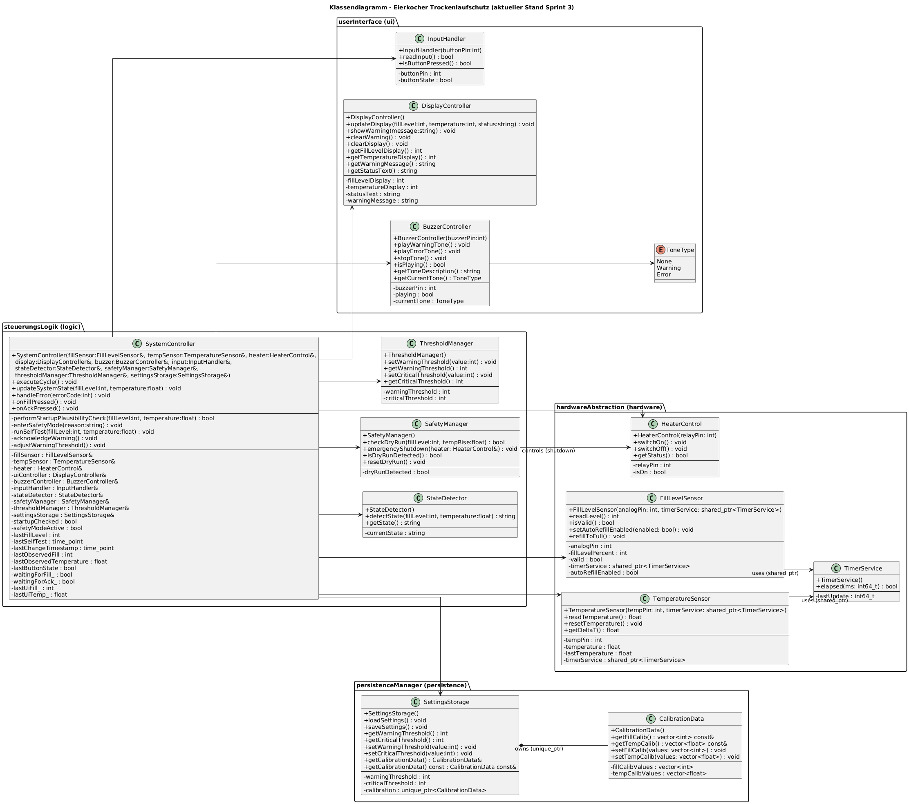
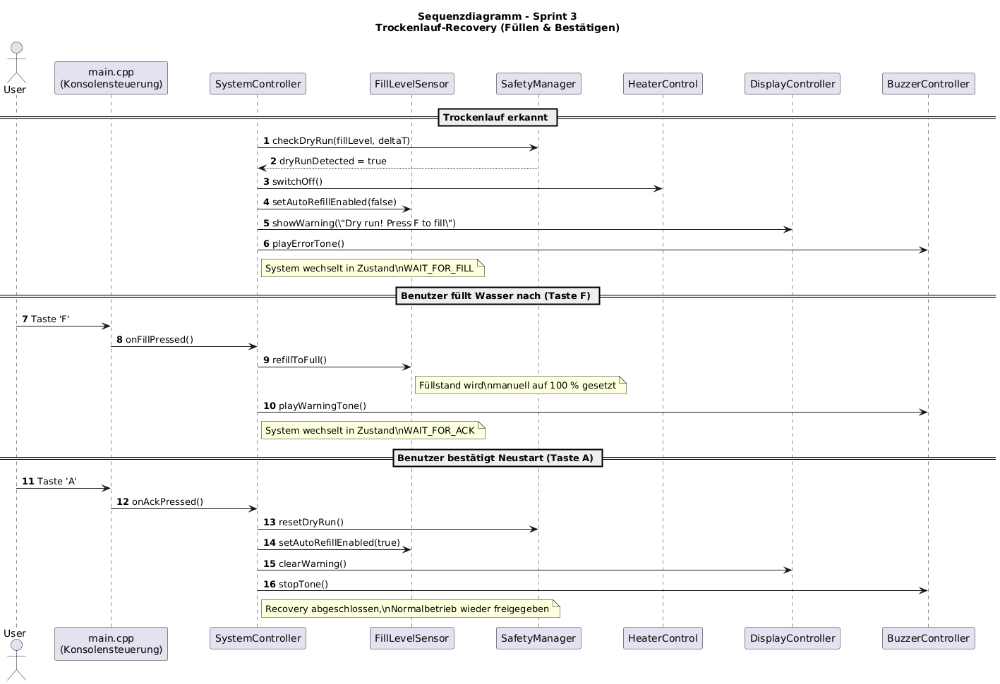

# Design 3

## 1. Ziel von Sprint 3

Sprint 3 fokussiert sich auf die **Verbesserung der Benutzerinteraktion, Warn- und Fehlersignalisierung** sowie auf ein **robustes, sicherheitsgerechtes Verhalten** im Trockenlauf-Fall.  
Die Änderungen dienen der Umsetzung der Requirements **R5.3–R5.6**.
Der Fokus liegt auf:

* stabiler Trockenlauf-Erkennung (gelatcht)
* manuellem Recovery-Prozess (Füllen + Quittierung)
* ereignisbasierter Konsolenausgabe
* konfigurierbaren Warnschwellen zur Laufzeit

## 2. Wesentliche funktionale Änderungen

### 2.1 Manueller Recovery-Mechanismus
Nach Erkennung eines Trockenlaufs wechselt das System in explizite Zustände:

- `WAIT_FOR_FILL`: Benutzer muss Wasser nachfüllen (`F`)
- `WAIT_FOR_ACK`: Benutzer bestätigt Neustart (`A`)

Währenddessen:
- bleibt die Heizung abgeschaltet
- bleibt der Buzzer aktiv
- werden Sensorwerte und Anzeige eingefroren

Ein automatischer Neustart ohne Benutzerinteraktion ist nicht mehr möglich.

---

### 2.2 Gelatchte Sicherheitslogik
Der Trockenlaufzustand wird nach der ersten Erkennung **persistent gehalten**, bis er explizit quittiert wird.  
Dadurch werden instabile Zustandswechsel und ein zyklisches Ein-/Ausschalten von Warnungen vermieden.

---

### 2.3 Erweiterung der Sensor-Simulation
Der `FillLevelSensor` unterstützt nun:
- deaktivierbares automatisches Wiederauffüllen
- manuelles Auffüllen per Benutzereingabe

Dies erhöht die Realitätsnähe der Simulation deutlich.

Sprint 3 baut vollständig auf der Architektur aus Sprint 2 auf und erweitert diese **ohne Bruch bestehender Schnittstellen**.

---

## 3. Klassendiagramm

## 4. Klassenänderungen in Sprint 3

### 4.1 `SystemController`

**Neue Verantwortlichkeiten:**

* Recovery-Zustandsmaschine
* Entkoppelte Anzeige-Werte (`lastUiFill_`, `lastUiTemp_`)
* Manuelle Eingaben (`onFillPressed()`, `onAckPressed()`)

**Neue Attribute (Auszug):**

* `waitingForFill`
* `waitingForAck`
* `lastUiFill_`
* `lastUiTemp_`

---

### 4.2 `SafetyManager`

**Erweiterungen:**

* gelatchte Trockenlauf-Erkennung
* explizite Rücksetzung (`resetDryRun()`)

---

### 4.3 `FillLevelSensor`

**Erweiterungen:**

* Abschaltbarer Auto-Refill
* Manuelles Füllen

Realistische Abbildung des physikalischen Systems.

---

### 4.4 `DisplayController`

**Erweiterungen:**

* separater Status-Text
* gezieltes Löschen von Warnungen (`clearWarning()`)

---

## 5. Zentrale Designentscheidungen in Sprint 3

### 5.1 Gelatchte Trockenlauf-Erkennung

**Problem vorher:**
Trockenlauf wurde zyklisch neu berechnet → wechselnde Zustände → Buzzer und Anzeige wirkten instabil.

**Lösung:**
Der `SafetyManager` hält den Trockenlaufzustand **persistent**, bis er explizit zurückgesetzt wird:

* `dryRunDetected` wird **einmal gesetzt**
* bleibt aktiv bis `resetDryRun()` aufgerufen wird

Fail-Safe-Prinzip: *Ein erkannter Fehler bleibt aktiv, bis der Benutzer handelt.*

---

### 5.2 Manueller Recovery-Flow (WAIT_FOR_FILL / WAIT_FOR_ACK)

Nach Trockenlauf schaltet das System in einen **gesperrten Recovery-Modus**:

| Zustand         | Bedeutung                             |
| --------------- | ------------------------------------- |
| `WAIT_FOR_FILL` | Benutzer muss Wasser nachfüllen (`F`) |
| `WAIT_FOR_ACK`  | Benutzer bestätigt Neustart (`A`)     |

In diesen Zuständen:

* Heizung ist **immer AUS**
* Anzeige wird **eingefroren**

---

### 5.3 Erweiterter `FillLevelSensor`

Der Füllstandssensor unterstützt nun zwei Betriebsarten:

* **Auto-Refill aktiv** (Normalbetrieb)
* **Auto-Refill deaktiviert** (Trockenlauf)

Neue Schnittstellen:

* `setAutoRefillEnabled(bool)`
* `refillToFull()`

---

### 5.5 Ereignisbasierte Konsolenausgabe

Pro Zyklus werden nur **Zustandsänderungen** ausgegeben:

* Warnung neu / quittiert
* Zustandswechsel
* Heizungsstatus geändert
* Buzzer gestartet / gestoppt

Technisch:

* Sammeln der Ereignisse in einem `std::vector<std::string>`
* Ausgabe in einem dedizierten Ereignisblock

Hohe Lesbarkeit bei laufender Simulation.

---

### 5.6 Einstellbare Warnschwelle zur Laufzeit

Über die Konsole kann die Warnschwelle dynamisch geändert werden:

* Taste `W`
* Eingabe eines Prozentwertes (10–50 %)
* sofortige Wirkung im System
* Speicherung über `SettingsStorage`

Direkter Zusammenhang zwischen Benutzeraktion, Anzeige, Buzzer und Systemverhalten.

---

## 6. Design Patterns in Sprint 3

### 6.1 Model–View–Controller (MVC)

Bleibt das zentrale Architekturpattern:

* **Model:** Sensoren, SafetyManager, ThresholdManager
* **View:** DisplayController, BuzzerController
* **Controller:** SystemController, InputHandler

Sprint 3 stärkt MVC durch:

* strengere Entkopplung von Anzeige und Logik
* klare Zustandsgrenzen

---

### 6.2 Singleton (konzeptionell)

Die Klassen:

* `SystemController`
* `SafetyManager`
* `StateDetector`

werden weiterhin **konzeptionell als Singleton** betrachtet:

* genau eine aktive Instanz
* global konsistenter Systemzustand

---

### 6.3 Zustandsautomat (State Machine)

Sprint 3 führt explizit eine **Zustandsmaschine** ein:

* Normalbetrieb
* `WAIT_FOR_FILL`
* `WAIT_FOR_ACK`

Klare, deterministische Systemübergänge – essenziell für sicherheitskritische Systeme.

---

## 7. Sequenzdiagramm

### 7.1 Zweck des Sequenzdiagramms
Das Sequenzdiagramm beschreibt den **Ablauf der Benutzerinteraktion zur Wiederinbetriebnahme des Eierkochers nach einem Trockenlauf**.  
Der Fokus liegt auf der **Teilfunktionalität „manuelles Füllen und Bestätigen“**, die in Sprint 3 neu eingeführt wurde.

Das Diagramm dient der **Veranschaulichung der Recovery-Logik** und ergänzt die statische Darstellung des Klassendiagramms um den **dynamischen Ablauf**.

---

### 7.2 Beteiligte Komponenten

| Komponente | Rolle |
|-----------|-------|
| **User** | Führt manuelle Aktionen aus (Füllen, Bestätigen) |
| **main.cpp** | Erfasst Tasteneingaben (`F`, `A`) |
| **SystemController** | Koordiniert Zustandsübergänge und Systemreaktionen |
| **FillLevelSensor** | Simuliert das manuelle Auffüllen des Wassers |
| **SafetyManager** | Verwaltet den Trockenlaufzustand |
| **HeaterControl** | Schaltet die Heizung sicher ab |
| **DisplayController** | Zeigt Warnungen und Benutzerhinweise an |
| **BuzzerController** | Gibt akustische Warn- und Fehlersignale aus |

---

### 7.3 Ablaufbeschreibung

#### 7.3.1 Trockenlauf-Erkennung
Wird ein Trockenlauf erkannt, schaltet das System in den Zustand **`WAIT_FOR_FILL`**:
- Die Heizung wird abgeschaltet.
- Eine Fehlermeldung wird angezeigt.
- Ein akustischer Fehlerton wird aktiviert.
- Ein automatischer Neustart ist nicht möglich.

---

#### 7.3.2 Manuelles Füllen
Der Benutzer füllt Wasser nach und bestätigt dies über die Taste **`F`**:
- Der Füllstand wird manuell auf 100 % gesetzt.
- Das System wechselt in den Zustand **`WAIT_FOR_ACK`**.
- Anzeige und Sensorwerte bleiben eingefroren.

---

#### 7.3.3 Bestätigung / Neustartfreigabe
Durch Drücken der Taste **`A`** quittiert der Benutzer den Fehler:
- Der Trockenlaufzustand wird zurückgesetzt.
- Die Warnanzeige und der Buzzer werden deaktiviert.
- Der Normalbetrieb wird wieder freigegeben.

---

### 7.4 Bezug zu Requirements

| Requirement | Abdeckung |
|------------|-----------|
| **R5.4** | Fehlermeldung Trockenlauf und explizite Benutzerquittierung |
| **R5.5** | Akustisches Warnsignal während des gesamten Fehlerzustands |
| **R3.x** | Sicheres Abschalten und kontrollierte Wiederinbetriebnahme |

---

## 8. Kommunikationsdiagramm

### 8.1 Ziel des Diagramms

Das Kommunikationsdiagramm zeigt die **Interaktion und Nachrichtenflüsse** zwischen den Hauptkomponenten des Systems  
während eines sicherheitskritischen Ereignisses (Trockenlauf, Überhitzung, Sensorfehler) und berücksichtigt die in Sprint 2 eingeführten Mechanismen:

---

### 8.2 Beteiligte Komponenten

| **Komponente**        | **Rolle / Funktion** |
|-----------------------|----------------------|
| **User (Aktor)**      | Startet das Gerät, kann Warnsignale stummschalten. |
| **UserInterface**     | `DisplayController`, `BuzzerController`, `InputHandler` – Visualisierung und akustische Signale, Eingabe. |
| **ControlLogic**      | `SystemController`, `StateDetector`, `SafetyManager`, `ThresholdManager` – Zentrale Steuer- und Sicherheitslogik. |
| **HardwareAbstraction** | `FillLevelSensor`, `TemperatureSensor`, `HeaterControl`, `TimerService` – Simulation von Sensorik und Aktorik. |
| **PersistenceManager**| `SettingsStorage`, `CalibrationData` – Bereitstellung von Schwellwerten und Kalibrierdaten. |

---

### 8.3 Ablaufbeschreibung

1. **Initialisierung & Laden der Einstellungen:**  
   - `ControlLogic` ruft `SettingsStorage.loadSettings()` auf und setzt die Schwellwerte im `ThresholdManager`.  

2. **Sensordatenerfassung und Zustandsdetektion:**  
   - `ControlLogic` fordert zyklisch über `HardwareAbstraction` Füllstand (`readLevel()`) und Temperatur (`readTemperature()`, `getDeltaT()`) an.  
   - `StateDetector.detectState()` liefert den logischen Zustand.  

3. **Plausibilitäts- und Fehlerprüfung:**  
   - Zu Beginn: `SystemController.performStartupPlausibilityCheck(...)` prüft initiale Werte.  
   - Laufend: `SystemController` prüft Sensorvalidität und Temperaturbereiche; `SafetyManager.checkDryRun(...)` erkennt Trockenlauf.  

4. **Sicherheitsreaktion und Fehlerklassifizierung:**  
   - Bei Fehlern oder Grenzwertverletzungen:  
     - `HeaterControl.switchOff()` oder `emergencyShutdown(heater)`  
     - `DisplayController.showWarning("...")` mit der passenden Fehlermeldung  
     - `BuzzerController.playWarningTone()` bzw. `playErrorTone()`  

5. **Selbsttest:**  
   - `SystemController.runSelfTest(...)` prüft periodisch, ob sich Sensorwerte verändern und meldet Abweichungen entsprechend.  

6. **Benutzerinteraktion:**  
   - `InputHandler.readInput()` liefert Tasterereignisse an `SystemController`.  
   - Bei erkannter Eingabe stoppt `SystemController` z. B. den Ton (`BuzzerController.stopTone()`).

---

### 8.4 Kommunikationsstruktur (Kurzüberblick)

| **Absender**    | **Empfänger**        | **Nachricht / Aktion**                              |
|-----------------|----------------------|-----------------------------------------------------|
| `User`          | `UserInterface`      | Gerät einschalten, Taste betätigen                 |
| `ControlLogic`  | `PersistenceManager` | `loadSettings()`                                   |
| `ControlLogic`  | `HardwareAbstraction`| `readLevel()`, `readTemperature()`, `switchOn()`, `switchOff()` |
| `ControlLogic`  | `UserInterface`      | `updateDisplay(...)`, `showWarning(...)`, `playWarningTone()`, `playErrorTone()`, `stopTone()` |
| `UserInterface` | `ControlLogic`       | Tasterzustände über `readInput()`                  |
